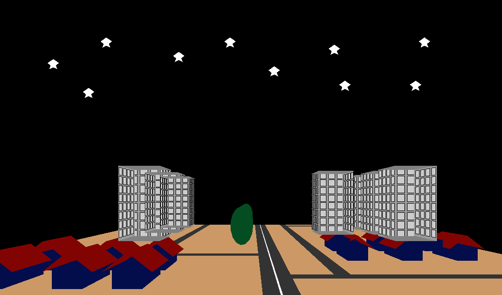

# Project Name

A simulation city project created using OpenGL, Glut and C++.



## Description

This project simulates a city environment with various elements such as buildings, houses, trees, dark sky with some stars and for sure roads. It serves as a simple demonstration of the capabilities of OpenGL and Glut libraries.

## Features

- Buildings and houses with different designs
- Roads and intersections
- observed transformations using built-in functions

## Prerequisites

- OpenGL library
- Glut library
- C++ compiler (e.g., GCC)

## Getting Started

1. Clone the repository:

   ```bash
   git clone https://github.com/iscoAdams/simulate-city.git

   ```

2. Compile the project:

- Configure your compiler to include OpenGL and Glut libraries.

- Set the appropriate environment variables.

- Compile the project using the following command:

````bash
    g++ main.cpp -lGL -lGLU -lglut
```


2.1. Alternatively, you can do the following:
    2.1.1. configure your compiler to include openGl and Glut libraries, in my case i used apt-get to install the necessary libraries.
    2.1.2. add a launch configration of the preferred compiler to the .vscode/launch.json file:
    2.1.3. create tasks.json and add the following lines to .vscode/tasks.json file:

```json
{
  "tasks": [
    {
      "type": "cppbuild",
      "label": "C/C++: g++ build active file",
      "command": "/usr/bin/g++",
      "args": [
        "-g",
        "${file}",
        "-o",
        "${fileDirname}/${fileBasenameNoExtension}",
        "-lGLU",
        "-lglfw",
        "-lGLEW",
        "-lGL",
        "-lglut"
      ],
      "options": {
        "cwd": "${workspaceFolder}"
      },
      "problemMatcher": ["$gcc"],
      "group": {
        "kind": "build",
        "isDefault": true
      },
      "detail": "Task generated by Debugger."
    }
  ],
  "version": "2.0.0"
}
````

3. Run the simulation:

```bash
    ./a.out
```

## contributors

- Yassa-Alqess
- Mark-bahaa
- Kero-magdy
- Kareem-salama
- Nancy-khaled
